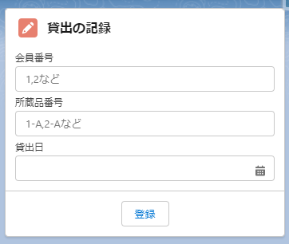

# 図書館システム

- [現場で役立つシステム設計の原則](https://www.amazon.co.jp/dp/477419087X)に沿った開発をSalesforceプラットフォーム上で実現する試み。
- [system-sekkei/library](https://github.com/system-sekkei/library)を題材として使用。

This software includes the work that is distributed in the [Apache License 2.0.](https://www.apache.org/licenses/LICENSE-2.0)
このソフトウェアは、 [Apache 2.0ライセンス](https://www.apache.org/licenses/LICENSE-2.0)で配布されている製作物が含まれています。